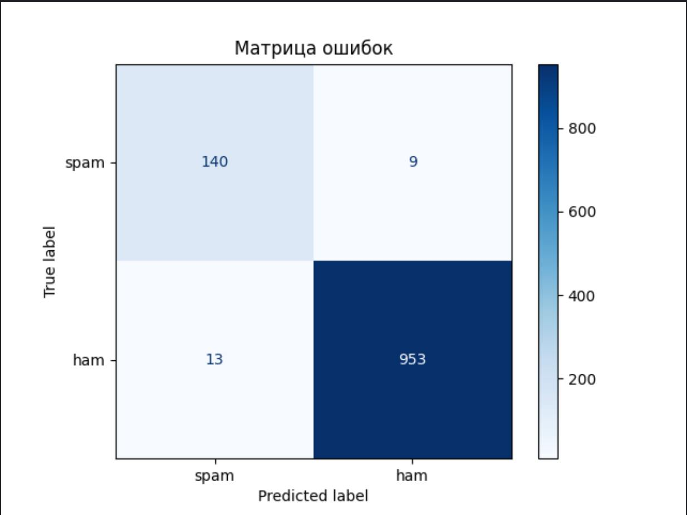

# Классификация SMS-сообщений с использованием наивного байесовского классификатора

## Описание проекта

Данный проект представляет собой реализацию наивного байесовского классификатора для определения, является ли SMS-сообщение **спамом** или **не спамом**. Классификатор обучается на датасете [SMSSpamCollection](https://archive.ics.uci.edu/ml/datasets/sms+spam+collection).

## Структура проекта

- **data_path**: Путь к датасету `SMSSpamCollection`.
- **NaiveBayesClassifier**: Класс для построения наивного байесовского классификатора.
- **preprocess_text()**: Функция для предобработки текстовых сообщений.
- **get_top_words()**: Функция для анализа наиболее частых слов в спам и не спам сообщениях.
- **train_test_split()**: Разделение датасета на обучающую и тестовую выборки.

## Установка и запуск

### 1. Клонируйте репозиторий
```bash
  git clone <URL вашего репозитория>
  cd <имя_папки_с_проектом>
```

### 2. Установите необходимые библиотеки
```bash
  pip install -r requirements.txt
```

### 3. Запустите скрипт
```bash
  python main.py
```
## Описание методов

- **`preprocess_text(text)`**: Приводит текст к нижнему регистру, удаляет знаки препинания и разбивает на слова.
- **`fit(X, y)`**: Обучает наивный байесовский классификатор на обучающей выборке.
- **`predict(X)`**: Прогнозирует класс для новых сообщений.
- **`score(X, y)`**: Оценивает точность модели на тестовой выборке.

## Результаты

### 1. Точность модели
Accuracy: 0.98

### 2. Распределение по классам
График распределения спам и не спам сообщений:


### 3. Топ-10 самых частых слов
Гистограммы с топ-10 самых частых слов в спам и не спам сообщениях:

**Спам**


**Не спам**


### 4. Матрица ошибок
Матрица ошибок для оценки качества классификации:



## Датасет
Датасет для обучения и тестирования доступен по следующей ссылке:
[SMSSpamCollection](https://archive.ics.uci.edu/ml/datasets/sms+spam+collection)